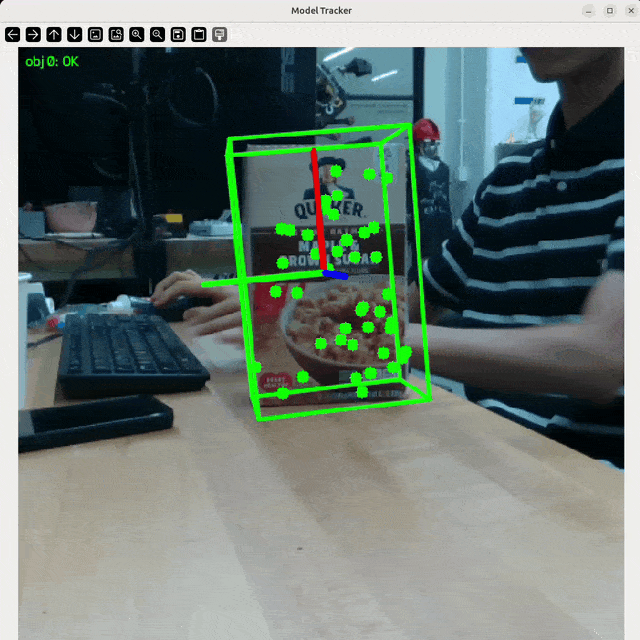

<div align="center">

# Point2Pose

### Occlusion-Recovering 6D Pose Tracking and 3D Reconstruction for Multiple Unknown Objects via 2D Point Trackers

**European Conference on Computer Vision (ECCV) 2026**

[Tzu-Yuan Lin](https://tzuyuan.github.io)<sup>1</sup> &nbsp;·&nbsp;
[Ho Jae Lee](https://hojae-io.github.io/)<sup>1</sup> &nbsp;·&nbsp;
[Kevin Doherty](https://keevindoherty.github.io/)<sup>2,§</sup> &nbsp;·&nbsp;
[Yonghyeon Lee](https://www.gabe-yhlee.com/)<sup>1</sup> &nbsp;·&nbsp;
[Sangbae Kim](https://meche.mit.edu/people/faculty/SANGBAE@MIT.EDU)<sup>1</sup>

<sup>1</sup>Massachusetts Institute of Technology &nbsp;&nbsp; <sup>2</sup>Boston Dynamics

<sup>§</sup>Work conducted in personal time and independently of the author's affiliated organization.

[](https://point2pose.github.io/)
[](https://arxiv.org/abs/2604.10415)
[](https://arxiv.org/pdf/2604.10415)
[](https://youtu.be/NRfGyx1nes4)


</div>

---

**Point2Pose** is a *model-free* method for causal 6D pose tracking of **multiple rigid objects** from RGB-D video, initialized from a few clicked image points. Long-range 2D point tracks keep correspondences alive, so a **fully occluded object is re-localized the instant it reappears** — and each target is reconstructed as a textured mesh while tracking.

## Disclaimer
**The readme is AI-generated. Please submit an issue if you find any problem.**

## ✨ Highlights

- **Model-free** — click a few points. No CAD model, no training.
- **Multi-object** — many objects at once, through mutual occlusion.
- **Occlusion recovery** — re-localized the instant the object reappears.
- **3D reconstruction** — online TSDF fusion, one textured mesh per object.
- **Modular** — every stage swappable from one YAML file.
- **Live demo** — RealSense, with an interactive [Rerun](https://rerun.io) 3D viewer.
- **New dataset** — `YCBMultiTrack`: multi-object RGB-D with mocap ground truth.


## 📰 News and Updates
- **[08/2026]** Model-based Point2Pose is released along with Gaussian splats reconstruction! 
- **[06/2026]** Point2Pose is accepted to **ECCV 2026**! 

## 🆕 Model-Based Point2Pose

We recently made a **model-based** variant of Point2Pose. The new framework supports:
- **Model-based tracking.** Given a Gaussian or mesh model, the system can track its 6D pose. [README](examples/model_based_tracking/README.md)
- **Gaussian Splats Reconstruction.** The new pipeline supports Gaussian splat reconstruction for higher visual modality. [README](examples/realsense_tracking/reconstruction/README.md)

<div align="center">

</div>

> Model-based tracking and the 3DGS reconstruction pipeline are contributed by **[Sang Min Kim](https://github.com/sangminkim-99)**. Sangmin is a great researcher on 3D vision and robotics! Check out [his other work](https://sangminkim-99.github.io/)

## 📑 Table of Contents

- [Installation](#-installation)
- [Model-Based Point2Pose](#-model-based-point2pose)
- [RealSense Live Demo](#-realsense-live-demo)
- [Running on Datasets](#-running-on-datasets)
- [Configuration & Architecture](#-configuration--architecture)
- [Outputs and Logging](#-outputs-and-logging)
- [Benchmarking Point Trackers](#-benchmarking-point-trackers)
- [Repository Structure](#-repository-structure)
- [Known Issues](#-known-issues)
- [Acknowledgements](#-acknowledgements)
- [License](#-license)
- [Citation](#-citation)

---

## 🛠 Installation

Tested on Ubuntu 22.04 with Python 3.11, PyTorch 2.4 + CUDA 12.1, and an NVIDIA RTX 4090.

### 1. Clone the repository

```bash
git clone --recurse-submodules git@github.com:tzuyuan/point-to-pose.git
cd point-to-pose
```

(Already cloned? `git submodule update --init --recursive`.)

### 2. Create the environment

```bash
conda env create -f environment.yml
conda activate point2pose
```

That is the whole setup — there is no package to install. Every entry-point script
adds the repository root to `sys.path`, so **run everything from the repository
root** and imports resolve on their own:

```bash
python examples/realsense_tracking/realsense_tracking.py
python experiments/ho3d/run_ho3d_single.py -v AP12 ...
```

The pins in [environment.yml](environment.yml) are the exact versions the paper
results were produced with (Ubuntu 22.04 · Python 3.11 · CUDA 12.1 · RTX 4090).
Three extras are commented out at the bottom of the file — uncomment what you
need: `pycuda` (CUDA TSDF fusion, needs `nvcc` at install time), `transformers`
(Track-On2 backend), `lcm` (LCM pose publishing).

<details>
<summary>Using pip / venv instead of conda</summary>

```bash
python -m venv .venv && source .venv/bin/activate
pip install -r requirements.txt
# other CUDA build: pip install -r requirements.txt --extra-index-url https://download.pytorch.org/whl/cu121
```

[requirements.txt](requirements.txt) carries the same pins as `environment.yml`.
</details>

### 3. Third-party components

Three components are not on PyPI and must be installed from source. The quick route:

```bash
pip install --no-build-isolation -r requirements-third-party.txt
```

(`--no-build-isolation` matters — these packages import torch at build time.) Or clone them individually, which is preferable if you want to read or patch their code:

<table>
<tr><th>Component</th><th>Used for</th><th>Install</th></tr>
<tr><td><a href="https://github.com/Gy920/segment-anything-2-real-time">SAM2 real-time</a></td><td>Segmentation (required)</td><td><code>git clone git@github.com:Gy920/segment-anything-2-real-time.git && cd segment-anything-2-real-time && pip install -e .</code></td></tr>
<tr><td><a href="https://github.com/google-deepmind/tapnet">tapnet</a> (BootsTAPIR)</td><td>Default point tracker (required)</td><td><code>git clone https://github.com/deepmind/tapnet.git && cd tapnet && pip install .</code></td></tr>
<tr><td><a href="https://github.com/cvg/LightGlue">LightGlue</a></td><td>SuperPoint keypoint sampling (required)</td><td><code>git clone https://github.com/cvg/LightGlue.git && cd LightGlue && pip install -e .</code></td></tr>
</table>

### 4. Download checkpoints

```bash
# SAM2 (from inside the segment-anything-2-real-time clone)
cd checkpoints && ./download_ckpts.sh
# then copy/symlink sam2.1_hiera_large.pt into point-to-pose/checkpoints/sam2.1/

# BootsTAPIR (default tracker)
wget -P checkpoints/tapir https://storage.googleapis.com/dm-tapnet/causal_tapir_checkpoint.npy
```

Expected layout (paths are configurable in the YAML configs):

```
checkpoints/
├── sam2.1/    sam2.1_hiera_large.pt          # segmentation
├── tapir/     causal_bootstapir_checkpoint.pt # default point tracker
├── tapnext/   tapnextpp_ckpt.pt              # optional tracker
└── trackon/   trackon2_dinov2_checkpoint.pt  # optional tracker
```

> ⚠️ **Update the paths in the configs.** The YAML files under [configs/](configs/) currently contain absolute paths (`/home/justin/code/point-to-pose/...`, `/home/justin/data/...`). Point `checkpoint_path`, `debug_dir`, and `pose_save_path` at your own locations before running.

### Swappable point trackers

The default tracker is BootsTAPIR (`type: tapir`). Four alternatives ship with the repo — all implement the same `Tracker` interface (`initialize`, `add_query_points`, `track_once`) and are selected purely by the `tracker:` block of the pipeline config. Example blocks for each are in [configs/pipeline/pipeline_test2.yaml](configs/pipeline/pipeline_test2.yaml).

| `type` | Method | Latency* | Notes |
|---|---|---|---|
| `tapir` | [BootsTAPIR](https://github.com/google-deepmind/tapnet) | ~18 ms | Default; used for all paper results |
| `tapnext` | [TAPNext++](https://arxiv.org/abs/2604.10582) | ~12 ms | Causal SSM state; strongest occlusion re-detection on single-object scenes |
| `trackon` | [Track-On2 / Track-On-R](https://arxiv.org/abs/2509.19115) | ~22 ms | Global patch-classification re-detection with a FIFO point memory |
| `litetracker` | [LiteTracker](https://arxiv.org/abs/2504.09904) | ~6 ms | Training-free causal CoTracker3; fastest, but local search only |
| `cotracker3_online` | [CoTracker3](https://github.com/facebookresearch/co-tracker) | ~41 ms | Reference baseline |

\* Tracker forward pass only, RTX 4090, at each tracker's benchmark resolution.

<details>
<summary><b>TAPNext++ setup</b> (<code>type: tapnext</code>)</summary>

Lives in `tapnet/tapnext/` of the tapnet repo, which must be recent enough to include it (commit `7f13cb6`, Apr 2026 or later):

```bash
cd tapnet && git pull   # or: git checkout origin/main -- tapnet/tapnext tapnet/tapnextpp
wget -P checkpoints/tapnext https://storage.googleapis.com/dm-tapnet/tapnextpp/tapnextpp_ckpt.pt
```

A 512-resolution fine-tuned checkpoint also exists (`https://storage.googleapis.com/gresearch/tapnextpp/tapnextpp_512.ckpt`, use with `input_resolution: 512`).

*Caveat:* TAPNext queries are position-only. Points added mid-stream are injected on the next processed frame; anchor-frame (past keyframe) queries are injected by position alone, since the recurrent state cannot be rewound. Its fixed 256×256 input also starves small objects when several share a frame, so it underperforms TAPIR on multi-object scenes.
</details>

<details>
<summary><b>Track-On2 setup</b> (<code>type: trackon</code>)</summary>

```bash
cd third_party
git clone https://github.com/gorkaydemir/track_on.git
pip install mmcv==2.2.0 -f https://download.openmmlab.com/mmcv/dist/cu121/torch2.4/index.html
pip install "transformers>=4.56.1"
```

The mmcv wheel URL must match your torch/CUDA version; see the [track_on README](https://github.com/gorkaydemir/track_on) for building from source.

```bash
# DINOv2 backbone (default, ungated; ViT backbone auto-downloads from HF)
wget -O checkpoints/trackon/trackon2_dinov2_checkpoint.pt "https://huggingface.co/gorkaydemir/track_on2/resolve/main/trackon2_dinov2_checkpoint.pt?download=true"

# DINOv3 variants (better real-world numbers, esp. Track-On-R)
wget -O checkpoints/trackon/trackon2_dinov3_checkpoint.pt "https://huggingface.co/gorkaydemir/track_on2/resolve/main/trackon2_dinov3_checkpoint.pt?download=true"
wget -O checkpoints/trackon/track_on_r.pt "https://huggingface.co/gorkaydemir/track_on_r/resolve/main/track_on_r.pt?download=true"
```

DINOv3 variants require access to [facebook/dinov3-vits16plus-pretrain-lvd1689m](https://huggingface.co/facebook/dinov3-vits16plus-pretrain-lvd1689m) (gated Meta license) plus `huggingface-cli login`, and `vit_backbone: dinov3_s_plus` in the config. Accuracy of the DINOv2 checkpoint is comparable per the authors, and it needs no login. mmcv ops are fp32-only.
</details>

<details>
<summary><b>LiteTracker setup</b> (<code>type: litetracker</code>)</summary>

```bash
cd third_party
git clone https://github.com/ImFusionGmbH/lite-tracker.git
```

No extra Python dependencies. Point `checkpoint_path` at the CoTracker3 [scaled_online.pth](https://huggingface.co/facebook/cotracker3/resolve/main/scaled_online.pth) weights (CC BY-NC — non-commercial). Like CoTracker3, localization is a local search around the previous position: robust for smooth motion, but it cannot re-detect a point that moved far while occluded.
</details>

---

## 🎥 RealSense Live Demo

Click a few points on any object in the live feed and Point2Pose starts tracking its 6D pose and reconstructing its mesh — no CAD model, no training.

### Requirements

- Intel RealSense RGB-D camera (tested on D435i / D455), USB 3.0
- NVIDIA GPU with CUDA (≥8 GB recommended)
- `pyrealsense2`, SAM2 and TAPIR checkpoints in place

### 1. Set your camera serial

```bash
rs-enumerate-devices -s     # find your serial
```

Set it in the config you plan to use:

```yaml
# configs/pipeline/pipeline_test2.yaml
realsense:
  params:
    rs_serial: 941322070969
```

Other keys worth checking in the same file: `pipeline.params.max_num_obj` (how many objects to track), `estimate_init_pose`, `debug_level`, `save_pose` / `pose_save_path`, and the `tracker:` block.

### 2. Run

```bash
conda activate point2pose
python examples/realsense_tracking/realsense_tracking.py     # 2D overlay only
```

### 3. Controls

| Key / mouse | Action |
|---|---|
| **Left click** | Add a *positive* prompt point to the current object |
| **Right click** | Add a *negative* prompt point (background / exclusion) |
| **`n`** | Finish this object and start prompting the **next** object |
| **`s`** | Start tracking with the collected prompts |
| **`r`** | Reset all prompt points |
| **`q`** | Quit |

Workflow: click 1–3 points on object #1 → press `n` → click points on object #2 → … → press `s`. A live SAM2 mask preview updates as you click, so you can verify the segmentation before committing. Once tracking starts, the window shows the masks, the tracked points, the estimated pose axes/box, and the frame counter.

### 3D visualization (Rerun)

`realsense_tracking_3d.py` runs the exact same demo and adds a live 3D UI:

```bash
python examples/realsense_tracking/realsense_tracking_3d.py \
    --config configs/pipeline/pipeline_test2.yaml \
    --viz-config configs/visualization/pose_3d_demo.yaml
```

Both flags are optional (without `--viz-config`, a `visualization_3d:` section in the pipeline config is used, otherwise built-in defaults). The Rerun viewer shows, on a scrubbable timeline:

- **Object frame · map** — the keypoint map, the growing TSDF mesh, camera trajectory, live-textured camera frustum, and keyframe frustums with RGB thumbnails.
- **Camera frame · trails** — the full map posed in the camera frame with fading per-point traces; the frustum turns **red when tracking is lost** and green again on recovery.
- **RGB / Events** — tracked points, SAM2 masks, and reprojection whiskers colored by pixel error.
- **Residual / Tracking** — residual (mm), inliers, tracked points, and FPS plots.

A button strip in the cv2 window toggles layers (`map · mesh · kfs · traj · bbox · traces · 2d · mask · reproj`) and cycles point coloring (`track_id → inlier → frame_id → uncertainty → object`). Set `visualization_3d.rerun.save_rrd: ./debug/session.rrd` to record the whole session and replay it later with `rerun session.rrd` — handy for cutting demo videos offline.

Other UI modes via `ui_mode`: `web` (viser, browser-based), `combined` (single cv2 dashboard with mp4 recording), `windows` (two Open3D windows). Full details: [examples/realsense_tracking/README_3D_VIZ.md](examples/realsense_tracking/README_3D_VIZ.md).

### Recording sequences

To capture RGB-D for offline runs (saved in the `YCBMultiTrack` layout: `rgb/`, `depth/` uint16 mm, `cam_K.txt`):

```bash
python examples/realsense_tracking/record_rgbd.py --out ~/data/my_take01 [--serial N]
# keys: r / space = start-stop recording, q / esc = quit
```

### Demo troubleshooting

| Symptom | Fix |
|---|---|
| Camera not found | Check `rs_serial` in the config and USB 3.0 connection |
| CUDA OOM | Use `sam2.1_hiera_small.pt`, lower the tracker resolution, or reduce `sampler.params.num_points` |
| Object flagged "lost" and never recovers | RealSense stereo depth residuals are ~3 mm; keep `register.params.residual_thres` and `map_growth_max_mean_residual` at ~0.006 (already set in `pipeline_test2.yaml`) |
| Pose rejected during normal handheld motion | Relax `pose_jump_guard_trans_thres` / `pose_jump_guard_rot_deg_thres` |
| Poor tracking | Better lighting, more textured surfaces, add negative prompt points to exclude background |

---

## 📊 Running on Datasets

Point2Pose is evaluated on [HO3D-v3](https://www.tugraz.at/index.php?id=40231), [YCBInEOAT](https://github.com/wenbowen123/iros20-6d-pose-tracking), and our own **YCBMultiTrack** (synthetic + real). Every runner takes `--data_path`, `--out_dir`, and `--config_path`; the paper settings live in `configs/ho3d_exp/eccv_final.yaml`, `configs/ycbineoat/eccv_final.yaml`, and `configs/ycbinisaac/eccv_final.yaml`.

```bash
# HO3D — single sequence / all 13 evaluation sequences
python experiments/ho3d/run_ho3d_single.py -v AP12 \
    --data_path /path/to/HO3D_V3 --out_dir results/ho3d_single \
    -c configs/ho3d_exp/eccv_final.yaml
python experiments/ho3d/run_ho3d_all.py \
    --data_path /path/to/HO3D_V3 --out_dir results/ho3d_all \
    -c configs/ho3d_exp/eccv_final.yaml

# YCBInEOAT
python experiments/ycbineoat/run_ycbineoat_all.py \
    --data_path /path/to/YCBInEOAT -m /path/to/YCB_models_with_ply \
    --out_dir results/ycbineoat_all -c configs/ycbineoat/eccv_final.yaml

# YCBMultiTrack (synthetic + real)
python experiments/ycbinisaac/run_ycbinisaac_all.py \
    --data_path /path/to/YCBMultiTrack -m /path/to/YCB_models \
    --out_dir results/ycbinisaac_all -c configs/ycbinisaac/eccv_final.yaml
```

Each runner writes per-sequence poses, ADD / ADD-S AUC tables, error-vs-time plots, and exported meshes (Chamfer distance against the ground-truth mesh where available) into `--out_dir`. Ablations from the paper are driven by [experiments/ho3d/run_ho3d_ablation.py](experiments/ho3d/run_ho3d_ablation.py), which sweeps every `configs/ho3d_exp/eccv_abla_*.yaml` config into its own output folder (`--data_path`, `--config_glob`, `--output_root`).

**Dataset layout.** `YCBInIsaacReader` / `YcbineoatReader` expect, per sequence: `rgb/` (or `jpg/`), `depth/`, `cam_K.txt`, plus `masks/<object>/` and `annotated_poses/<object>/` for evaluation; `Ho3dReader` reads the standard HO3D `evaluation/<seq>/` layout. See [point2pose/io/sources/dataset/datareader.py](point2pose/io/sources/dataset/datareader.py).

---

## 🧩 Configuration & Architecture

The pipeline is a registry of interchangeable modules assembled from one YAML file. Every block has a `type` (registry key) and a `params` dict, so swapping a component never requires touching code.


<div align="center">

</div>

| Block | Registry keys |
|---|---|
| `segmenter` | `sam2`, `dummy` |
| `tracker` | `tapir`, `tapnext`, `trackon`, `litetracker`, `cotracker3_online`, `cotracker3_offline` |
| `sampler` | `super_point_balanced`, `super_point_fps`, `super_point`, `uniform_fps`, `random`, `orb` |
| `register` | `svd_residual_outlier`, `svd_cluster_ransac`, `svd_cluster_sdf_refine`, `svd_cluster`, `svd_ransac`, `svd`, `svd_outlier_sdf`, `svd_uncertainty_irls`, `svd_uncertainty_outlier`, `pnp_cluster_ransac`, `open3d_icp`, `teaserpp` |
| `local_optimizer` / `global_optimizer` | `lm_graph`, `lm_graph_reproj`, `lm_graph_sdf`, `isam2` |
| `criterion` | `rotation_threshold`, `rotation_threshold_and_min_num`, `rotation_threshold_and_min_num_spread`, `rotation_grid`, `registration_residual`, `uncertainty_ratio`, `uncertainty_number`, `mask_area`, `iteration` |
| `reconstructor` | `sdf_builder` |

Key pipeline parameters: `max_num_obj`, `frame_reg_mode` (`f2f` / `f2m` / `hybrid`), `estimate_init_pose`, `use_graph_optimization`, and the pose-jump-guard / map-growth gates. [configs/pipeline/pipeline_test2.yaml](configs/pipeline/pipeline_test2.yaml) is the annotated reference config.

Adding a new module is three steps: subclass the base class in [point2pose/core/](point2pose/core/), decorate it with `@TRACKER.register_module("my_tracker")` (or the relevant registry), and point the config's `type` at the new key.

---

## 💾 Outputs and Logging

Set in the pipeline config:

```yaml
pipeline:
  params:
    save_pose: true
    pose_save_path: /path/to/poses
    debug_level: 1                 # 0-2
    debug_dir: /path/to/debug
```

| File | Contents |
|---|---|
| `obj_<i>_pose.txt` | Per-object pose in **TUM format**: `timestamp tx ty tz qx qy qz qw` (meters) |
| `registration_stats.txt` | Per-frame registration diagnostics: iterations, threshold, residual mean/median/max, inlier counts |
| `<debug_dir>/output_images/` | Annotated frames (points, masks, pose box) when `visualization.params.save_images: true` |
| exported meshes | Reconstructed TSDF meshes (`.ply`, optionally textured `.glb`) written by the dataset runners |

Full description: [doc/pose_logging.md](doc/pose_logging.md).

---

## 📁 Repository Structure

```
point2pose/
├── core/           base classes + module registry
├── data_types/     Frame, KeyFrame, PointTrackTable, results
├── io/             dataset readers, RealSense source, pose/point-cloud logging
├── modules/        segmenter · tracker · sampler · register · optimizer · criterion · reconstruction
├── pipeline/       ModularPipeline and its components
├── visualization/  Rerun / viser / Open3D dashboards
└── utils/          transforms, Lie algebra, evaluation, mesh metrics

configs/            per-dataset and per-experiment YAML (eccv_final.yaml = paper settings)
environment.yml     conda environment (requirements.txt carries the same pins for pip/venv)
examples/           RealSense live demo (2D, 3D viz, recorder)
experiments/        dataset runners, ablations, tracker sweep
scripts/            benchmarks, debug visualization, paper/poster figures
test/               pytest unit tests (`pytest`)
doc/                pose logging and RealSense tracker docs
```

---

## ⚠️ Known Issues

- **OpenCV window hangs when importing torchvision first.** With torchvision 0.19 + opencv-python 4.11, importing torchvision *before* the first `cv2.namedWindow` call makes that call spin forever. The tracker modules therefore defer heavy imports until construction — when writing new scripts with an OpenCV UI, **create the window before constructing `ModularPipeline`** (the RealSense demo already does this).
- **Global bf16 autocast.** The SAM2 segmenter module enables global bf16 autocast at import time; be aware if you mix in fp32-only ops (e.g. mmcv used by Track-On).
- **numpy pinning.** `rerun-sdk` ≥ 0.36 needs numpy ≥ 2, while numba (< 2.3) and tensorflow (< 2.2) impose upper bounds — numpy 2.1.3 satisfies all three.
- **Absolute paths in configs.** The shipped YAML files reference the authors' machine paths; update them for your setup.

---

## 🙏 Acknowledgements

This work builds on excellent open-source projects: [SAM2](https://github.com/facebookresearch/sam2) and its [real-time fork](https://github.com/Gy920/segment-anything-2-real-time), [TAPIR / BootsTAPIR and TAPNext](https://github.com/google-deepmind/tapnet), [Track-On2](https://github.com/gorkaydemir/track_on), [LiteTracker](https://github.com/ImFusionGmbH/lite-tracker), [CoTracker3](https://github.com/facebookresearch/co-tracker), [LightGlue / SuperPoint](https://github.com/cvg/LightGlue), [GTSAM](https://github.com/borglab/gtsam), [Open3D](https://www.open3d.org/), and [Rerun](https://rerun.io). We also thank the authors of [BundleTrack](https://github.com/wenbowen123/BundleTrack), [BundleSDF](https://github.com/NVlabs/BundleSDF), and [FoundationPose](https://github.com/NVlabs/FoundationPose) for their datasets and baselines.

## 📄 License

Released under the [BSD 3-Clause License](LICENSE). Third-party components keep their own licenses — note in particular that CoTracker3 weights (used by `cotracker3_online` and `litetracker`) are **CC BY-NC** (non-commercial).

## 📚 Citation

If you find Point2Pose useful in your research, please cite:

```bibtex
@inproceedings{lin2026point2pose,
  title     = {Point2Pose: Occlusion-Recovering 6D Pose Tracking and 3D Reconstruction
               for Multiple Unknown Objects via 2D Point Trackers},
  author    = {Lin, Tzu-Yuan and Lee, Ho Jae and Doherty, Kevin and Lee, Yonghyeon and Kim, Sangbae},
  booktitle = {European Conference on Computer Vision (ECCV)},
  year      = {2026},
}
```
