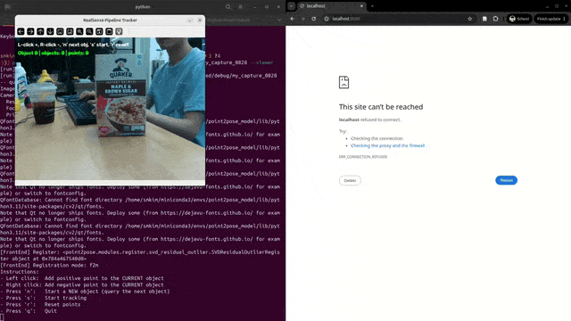

## 3D Reconstruction



Run:
```bash
python examples/realsense_tracking/reconstruction/run.py --name my_capture
```

If `gsplat` fails on first run with `cuda_runtime_api.h: No such file or
directory`, set:
```bash
export CUDA_HOME=$CONDA_PREFIX
export CPATH=$CONDA_PREFIX/targets/x86_64-linux/include:$CPATH
```

Add `--viewer` for a live preview during training:
```bash
python examples/realsense_tracking/reconstruction/run.py --name my_capture --viewer
```

The output is saved to `debug/my_capture/gaussians.pt`.
